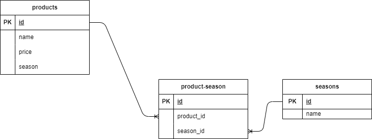

#　アプリケーション名


　　確認テスト＿もぎたて

　　laravel/just-checkedディレクトリを作成し、開発のルートディレクトリとして使用した。

　　下記３画面を作成
　　１．商品一覧画面
　　２．商品詳細・変更画面
　　３．商品登録画面

　　実装した機能

　　１．商品一覧画面
　
　　　（１）商品名、値段、商品画像を６カード/ページで表示
　　　　　　　ページニングあり

　　　　（２）商品検索
　　　　　　　　キー：商品名　部分一致検索可
　
  　　　（３）商品並べ替え
　　　　　　　　下記条件を選択しソート
　　　　　　　　価格の高い順
　　　　　　　　価格の低い順
　
　　　　（４）商品画像クリックで商品詳細。変更画面へ

　　　　（５）「商品を追加」ボタンクリックで商品登録画面へ　　　　　　

　　２．商品詳細・変更画面
　
　　　（１）商品画像、商品名、値段、季節、商品説明の表示
　　　　　　　季節データが２個以上ある場合も表示可能とした。

　　　　（２）商品画像、商品名、値段、季節、商品説明の入力
　　　　　　　季節データは入力可もテーブルには登録しない
　　　　　　　商品画像はWindowsフォルダ画面から選択

　　　　（３）「変更を保存」ボタンクリックでテーブルの該当レコード更新

　　　　（４）「戻る」ボタンクリックで商品一覧画面に戻る

　　　　（５）ゴミ箱画像クリックでデータの論理削除


　　３．商品登録画面

　　　　（１）商品画像、商品名、値段、季節、商品説明の新規入力
　　　　　　　季節は一つのみ選択可
　　　　　　　商品画像はWindowsフォルダ画面から選択

　　　　（２）「登録」ボタンクリックでテーブルにレコード追加
　　　　　　　　productテーブルとproduct-seasonテーブルに追加

　　　　（３）「戻る」ボタンクリックで商品一覧画面に戻る
　　　　　　　
　　注意点
　　　　１．ソートされた後ページ遷移するとソートがリセットされる

　　　　２．バリデーションでimage指定すると.pngがパスしないため今回
　　　　　はimage指定せず。<input>文で拡張子制限をかけた。

　　　　３．季節選択は２．の表示のみ複数可とした。


##環境構築
環境構築

下記手順にてセットアップを行った。

------------------　ディレクトリ作成 -----------------

C:\Users\user\coachtech\laravel>cd just-picked

C:\Users\user\coachtech\laravel\just-picked>mkdir docker

C:\Users\user\coachtech\laravel\just-picked>mkdir src

C:\Users\user\coachtech\laravel\just-picked>copy nul docker-compose.yml
1 個のファイルをコピーしました。

C:\Users\user\coachtech\laravel\just-picked>cd docker

C:\Users\user\coachtech\laravel\just-picked\docker>mkdir mysql

C:\Users\user\coachtech\laravel\just-picked\docker>mkdir nginx

C:\Users\user\coachtech\laravel\just-picked\docker>mkdir php

C:\Users\user\coachtech\laravel\just-picked\docker>cd mysql

C:\Users\user\coachtech\laravel\just-picked\docker\mysql>mkdir data

C:\Users\user\coachtech\laravel\just-picked\docker\mysql>copy nul my.cnf
1 個のファイルをコピーしました。

C:\Users\user\coachtech\laravel\just-picked\docker\mysql>cd ../nginx

C:\Users\user\coachtech\laravel\just-picked\docker\nginx>copy nul default.conf
1 個のファイルをコピーしました。

C:\Users\user\coachtech\laravel\just-picked\docker\nginx>cd ../php

C:\Users\user\coachtech\laravel\just-picked\docker\php>copy nul Dockerfile
1 個のファイルをコピーしました。

C:\Users\user\coachtech\laravel\just-picked\docker\php>copy nul php.ini
1 個のファイルをコピーしました。

C:\Users\user\coachtech\laravel\just-picked\docker\php>cd ../../

C:\Users\user\coachtech\laravel\just-picked>tree /f
フォルダー パスの一覧:  ボリューム Windows
ボリューム シリアル番号は 00BF-AB0B です
C:.Docker
│  docker-compose.yml
│
├─docker
│  ├─mysql
│  │  │  my.cnf
│  │  │
│  │  └─data
│  ├─nginx
│

  │      default.conf
│  │
│  └─php
│          Dockerfile
│          php.ini
│
└─src

------------------- Docker 立ち上げ ----------------------------------

C:\Users\user\coachtech\laravel\just-picked>docker-compose up -d — build

[+] Building 1.4s (11/11) FINISHED                        docker:desktop-linux
=> [php internal] load build definition from Dockerfile                  0.1s
=> => transferring dockerfile: 384B                                      0.0s

.

.

.

.


C:\Users\user\coachtech\laravel\just-picked>docker-compose exec php bash
time="2025-05-26T08:54:28+09:00" level=warning msg="C:\\Users\\user\\coachtech\\laravel\\just-picked\\docker-compose.yml: the attribute `version` is obsolete, it will be ignored, please remove it to avoid potential confusion"


----------------------- composer 状態確認　------------------------------------


root@be49dc270ee3:/var/www# composer -v


/ ***/**  ____ ___  ____  ____  ________  _____
/ /   / __ \/ __ `*_ \/ __ \/ __ \/ */ _ \/ **/
/ /**/ // / / / / / / // / /*/ (__  )  **/ /
\/\/*/ /*/ /*/ .***/\**/**/\_*//
/*/
Composer version 2.8.8 2025-04-04 16:56:46

.

.

.

update               [u|upgrade] Updates your dependencies to the latest version according to composer.json, and updates the composer.lock file
validate             Validates a composer.json and composer.lock
root@be49dc270ee3:/var/www#


------------------------ Laravel インストール -------------------------------------


root@be49dc270ee3:/var/www# composer create-project "laravel/laravel=8.*" . --prefer-dist
Creating a "laravel/laravel=8.*" project at "./"
Installing laravel/laravel (v8.6.12)

- Downloading laravel/laravel (v8.6.12)
- Installing laravel/laravel (v8.6.12): Extracting archive
Created project in /var/www/.

> @php -r "file_exists('.env') || copy('.env.example', '.env');"
Loading composer repositories with package information
Updating dependencies
Lock file operations: 107 installs, 0 updates, 0 removals
> 
- Locking asm89/stack-cors (v2.3.0)
- Locking brick/math (0.9.3)
- Locking carbonphp/carbon-doctrine-types (2.1

.

.

.

root@be49dc270ee3:/var/www# ls
README.md  composer.json  package.json  routes      vendor
app        composer.lock  phpunit.xml   server.php  webpack.mix.js
artisan    config         public        storage
bootstrap  database       resources     tests
root@be49dc270ee3:/var/www#


-------------- storage ディレクトリへのアクセス許可設定 ------------------


root@be49dc270ee3:/var/www# chmod -R 775 strage
root@be49dc270ee3:/var/www# chown -R www-data storage
root@be49dc270ee3:/var/www


--------------- システム時間の日本時間への変更 ----------------------

```php
 ======== app.php =============
 .
     | Here you may specify the default timezone for your application, which
    | will be used by the PHP date and date-time functions. We have gone
    | ahead and set this to a sensible default for you out of the box.
    |
    */

    'timezone' => 'Asia/Tokyo',
```

------------- 日本時間への変更確認 ----------------------


root@be49dc270ee3:/var/www# php artisan tinker
Psy Shell v0.12.8 (PHP 7.4.9 — cli) by Justin Hileman

>echo Carbon\Carbon::now();
2025-05-26 09:59:07⏎

---------------- migration ------------------------------------


## 使用技術・実行環境

OS：Windows10
エディション	Windows 10 Pro
バージョン	2009
ビルド	19045.5854


laravel/laravel (v8.6.12)


----------------------Docker-compose.yml ----------------------------
services:
    nginx:
        image: nginx:1.21.1
        ports:
            - "80:80"
        volumes:
            - ./docker/nginx/default.conf:/etc/nginx/conf.d/default.conf
            - ./src:/var/www/
        depends_on:
            - php

    php:
        build: ./docker/php
        volumes:
            - ./src:/var/www/

    mysql:
        image: mysql:8.0.26
        environment:
            MYSQL_ROOT_PASSWORD: root
            MYSQL_DATABASE: laravel_db
            MYSQL_USER: laravel_user
            MYSQL_PASSWORD: laravel_pass
        command:
            mysqld --default-authentication-plugin=mysql_native_password
        volumes:
            - ./docker/mysql/data:/var/lib/mysql
            - ./docker/mysql/my.cnf:/etc/mysql/conf.d/my.cnf

    phpmyadmin:
        image: phpmyadmin/phpmyadmin
        environment:
            - PMA_ARBITRARY=1
            - PMA_HOST=mysql
            - PMA_USER=laravel_user
            - PMA_PASSWORD=laravel_pass
        depends_on:
            - mysql
        ports:
            - 8080:80


## ER図

　　　/laravel/just-pick/just-picked-ERD.drawio.png 参照
     


## URL
/just-picked-ERD.drawing.png
　　　開発環境:   http://localhost/
　　　PHPAdmin：　http://localhost:8080
     リポジトリ:　


